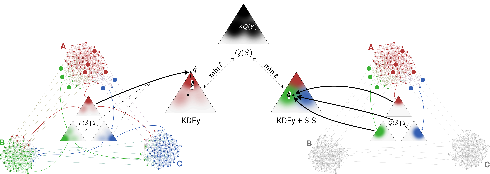

# Structural Importance Sampling for Graph Quantification

  
<a href="https://ecmlpkdd-storage.s3.eu-central-1.amazonaws.com/preprints/2025/research/preprint_ecml_pkdd_2025_research_1603.pdf">Read Paper</a>

> Clemens Damke and Eyke Hüllermeier
> *"Distribution Matching for Graph Quantification under Structural Covariate Shift"*
> Accepted at ECML-PKDD 2025

## Structure

The implementation of quantification is split across multiple modules:
- [`data/quantification.py`](./gq/data/quantification.py): Implementation for synthetic distribution shift (PPS, BFS- and PPR-based covariate shift).
- [`nn/quantification_metrics.py`](./gq/nn/quantification_metrics.py): Contains implementations for generic quantification methods (CC, ACC, DMy, KDEy). The implementation makes use of the QuaPy library.
- [`nn/graph_quantification_metrics.py`](./gq/nn/graph_quantification_metrics.py): Contains implementations of NACC and SIS for ACC (PPR and SP kernels).
